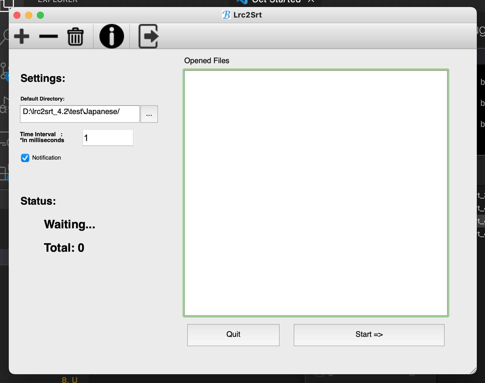

# Introduction

Lrc2Srt is a graphical application for converting `.lrc` subtitle files into the `.srt` filetype/format.
To aid in the conversion of translations into a video-readable format.

`.lrc` files are only timestamped based on when the start of each line is, Lrc2Srt reads in the `.lrc` file, and calculates the time range of each line and when it *should* end given it's successor/next door neighbor.

`Time Interval` defines how much the transition time between lines should be.

# Running

Lrc2Srt runs on Python 3.5 with PyQt4, meaning the easiest way to run it is probably with Miniconda:
1. `conda create -n py35 python=3.5`
2. `conda activate py35`
3. `conda install -c free pyqt=4`
4. `python lrc2srt.py`

# Screenshot

